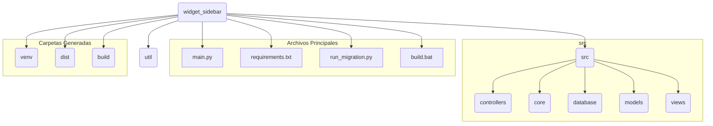

# Estructura del Proyecto Widget Sidebar

A continuación se muestra un diagrama de la estructura principal de carpetas y archivos del proyecto.

```mermaid
graph TD
    A(widget_sidebar) --> B(src);
    A --> C(venv);
    A --> D(dist);
    A --> E(build);
    A --> F(util);
    A --> G[main.py];
    A --> H[requirements.txt];
    A --> I[run_migration.py];
    A --> J[build.bat];

    subgraph src
        B --> B1(controllers);
        B --> B2(core);
        B --> B3(database);
        B --> B4(models);
        B --> B5(views);
    end

    subgraph "Archivos Principales"
        G; H; I; J;
    end

    subgraph "Carpetas Generadas"
        C; D; E;
    end
```
